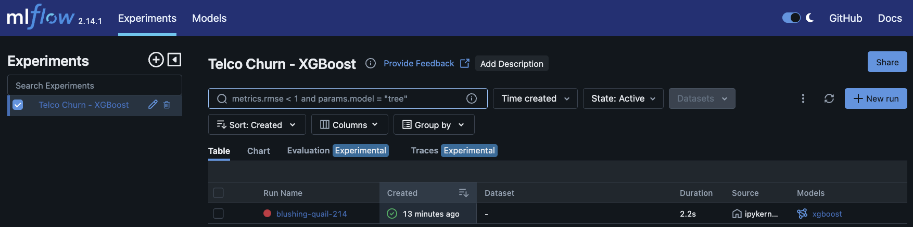
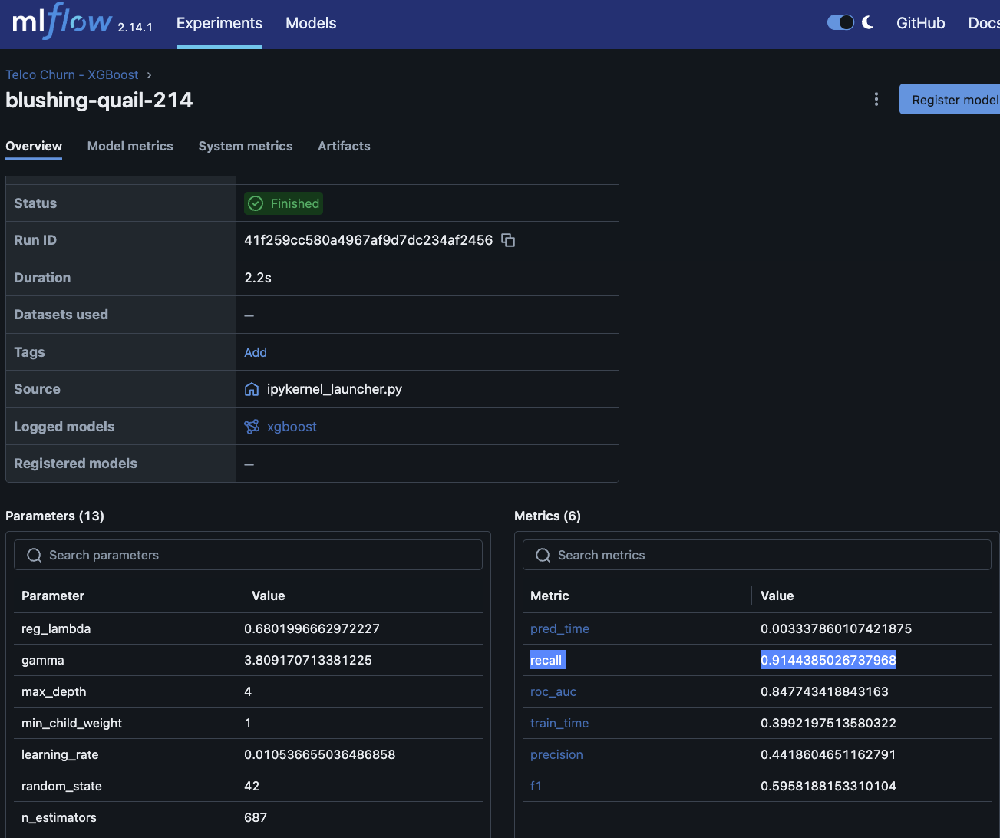

# customer-churn-prediction-mlops

An end-to-end machine learning project predicting customer churn on the Telco dataset. It uses **[Optuna](https://optuna.org/)** to perform hyperparameter tuning and **[MLflow](https://mlflow.org/)** to track experiments (parameters, metrics, and the serialized model). See [Hyperparameter tuning (Optuna)](#hyperparameter-tuning-optuna) and [Experiment tracking (MLflow)](#experiment-tracking-mlflow) below for details.

A `requirements.txt` file has been added with pinned project dependencies.

## Dataset

This project uses the **Telco Customer Churn** dataset from [Kaggle](https://www.kaggle.com/datasets/blastchar/telco-customer-churn?resource=download).

### About the dataset

**Context:** *"Predict behavior to retain customers. You can analyze all relevant customer data and develop focused customer retention programs."* (IBM Sample Data Sets)

Each row represents a customer; each column contains customer attributes described in the column metadata. The dataset includes:

- **Churn** — customers who left within the last month
- **Services** — phone, multiple lines, internet, online security, online backup, device protection, tech support, and streaming TV and movies
- **Account info** — tenure, contract, payment method, paperless billing, monthly charges, and total charges
- **Demographics** — gender, age range, partner, and dependents

### Churn labels and class imbalance

The target column **Churn** is binary:

- `0` — customer did not churn
- `1` — customer churned within the last month

In the raw CSV, churn appears as `No` / `Yes` and is mapped to `0` / `1` during preprocessing.

The dataset is **class-imbalanced** (7,043 labeled rows after cleaning):

| Label | Meaning  | Count |
|-------|----------|-------|
| 0     | No churn | 5,174 |
| 1     | Churn    | 1,869 |

Roughly **27%** of customers churned and **73%** did not.

### Handling imbalance

In this project, the main goal is simple — **we do not want to lose clients**. If we predict that a customer will stay but they actually churn (false negative), we miss the chance to retain them. That is why we are focusing on **recall** as the key metric, not just overall accuracy.

To handle the class imbalance, we are using **decision threshold tuning** instead of aggressive oversampling. Model probabilities are converted to churn predictions using a tuned cutoff lower than the default `0.5` (initial value: `0.3`), so that more likely churners are flagged and recall improves. Threshold selection and evaluation are documented in [`notebooks/exploratory_data_analysis.ipynb`](notebooks/exploratory_data_analysis.ipynb).

## Machine learning - Tests with RandomForest Classifier, LightGBM Classifier and XGBoost Classifier

Three classifiers were compared in [`notebooks/exploratory_data_analysis.ipynb`](notebooks/exploratory_data_analysis.ipynb) using a decision threshold of `0.3` (to prioritize recall over the default `0.5`). The recall values below are **without hyperparameter tuning**:

| Model | Recall (class 1) |
|-------|------------------|
| RandomForest Classifier | ~0.717 |
| LightGBM Classifier | 0.818 |
| XGBoost Classifier | 0.818 |

**XGBoost** was chosen as the production model because:

- Recall is high (**0.818**, without hyperparameter tuning) — matching LightGBM on this metric
- Faster to train (~3x faster than LightGBM)

Hyperparameter tuning and experiment tracking for the final model are documented in the sections below.

### Hyperparameter tuning (Optuna)

After selecting XGBoost, hyperparameters were tuned with [Optuna](https://optuna.org/) over **30 trials** in [`notebooks/exploratory_data_analysis.ipynb`](notebooks/exploratory_data_analysis.ipynb).

- The objective maximizes **recall for churners** (class 1) on the held-out test set, using the same decision threshold (`0.3`) as the baseline comparison.
- Search space includes: `n_estimators`, `learning_rate`, `max_depth`, `subsample`, `colsample_bytree`, `min_child_weight`, `gamma`, `reg_alpha`, `reg_lambda`, plus `scale_pos_weight` for class imbalance.
- **Result**: tuned recall improved from **0.818** (baseline) to **0.914**; precision dropped to **0.442** — a deliberate trade-off aligned with the retention-focused goal documented earlier in this README.

### Experiment tracking (MLflow)

The final tuned XGBoost run is logged to [MLflow](https://mlflow.org/) under the experiment **`Telco Churn - XGBoost`**.

- Logged artifacts: best hyperparameters, metrics (`precision`, `recall`, `f1`, `roc_auc`, `train_time`, `pred_time`), and the serialized XGBoost model.
- Runs are stored locally in [`mlruns/`](mlruns/).
- To inspect runs in the UI (after activating the conda env):

```bash
mlflow ui
```

Then open `http://127.0.0.1:5000` in a browser.

The `Telco Churn - XGBoost` experiment and the tuned run as seen in the MLflow UI:





**Inspiration:** Explore churn prediction models and learn more about customer retention.

**Updated source:** A newer version is available from [IBM Community](https://community.ibm.com/community/user/businessanalytics/blogs/steven-macko/2019/07/11/telco-customer-churn-1113).

## Local setup

1. Ensure conda (Miniconda or Anaconda) is installed.
2. **macOS only:** Install OpenMP (`libomp`) via Homebrew — required for LightGBM and XGBoost:

```bash
brew install libomp
```

3. Create and activate a conda environment named `customer-churn-prediction-mlops` with Python 3.12:

```bash
conda create -n customer-churn-prediction-mlops python=3.12 -y
conda activate customer-churn-prediction-mlops
pip install -r requirements.txt
```

> **Note:** Be careful when running or changing code that affects production. Use this local environment for development and testing only.
